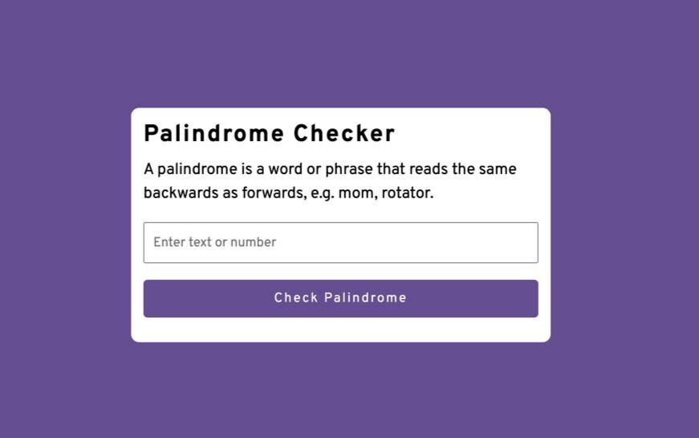

 

 

# PALINDROME CHECKER

[LIVE-URL](https://mike-dave.github.io/palindrome-checker/)

 

 

## About the Project

A palindrome is a word, number, phrase, or other sequence of symbols that reads the same backwards as forwards, such as mom or racecar etc.

This project is on the basics of javascript and Dom manipulation.

Users should be able to:

1. View a responsive layout regardless of their screen size
1. Check if their inputed letters and/or nuumbers are palindrome

## Built With

- CSS Flexbox
- CSS Variables
- Mobile-first workflow
- HTML
- Semantic HTML5
- Function
- DOM manipulation
- Javascript

## Useful resources

- #### [Stackoverflow](https://stackoverflow.com/) - This is a great site for solutions to your problems, especially if you get stucked.

- #### [MDN DOCS](https://developer.mozilla.org/) - This is an amazing site to read about the documentations of html, css and javascript properties.
- #### [Google Fonts](https://fonts.google.com/) - For all kinds of font styles, this is highly recommended.

## Acknowledgments

Design :
[I got the design from coding Nepal](https://codingnepalweb.com/demos/palindrome-checker-javascript/)
